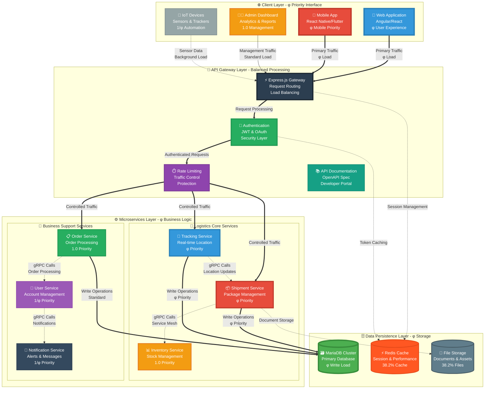
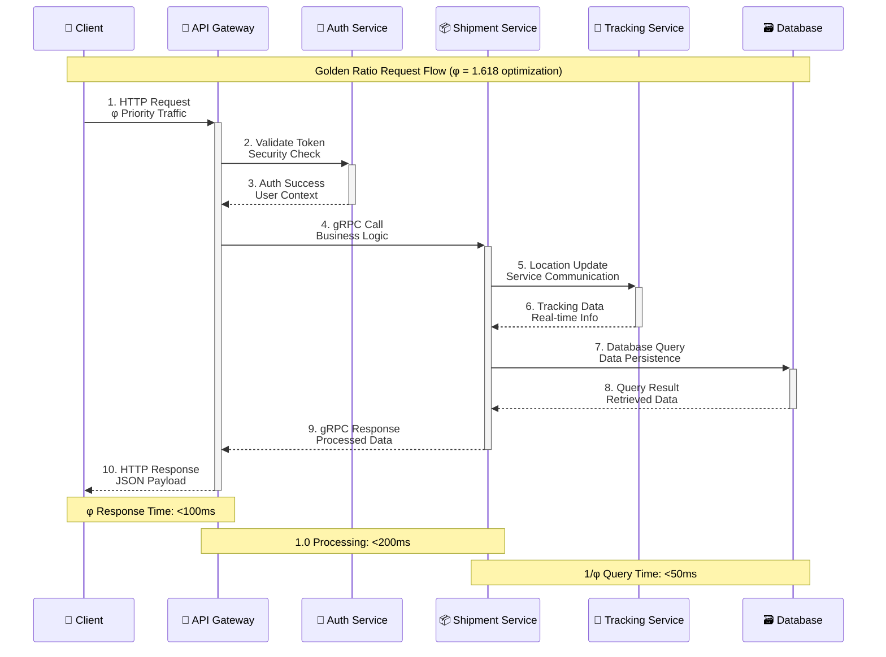
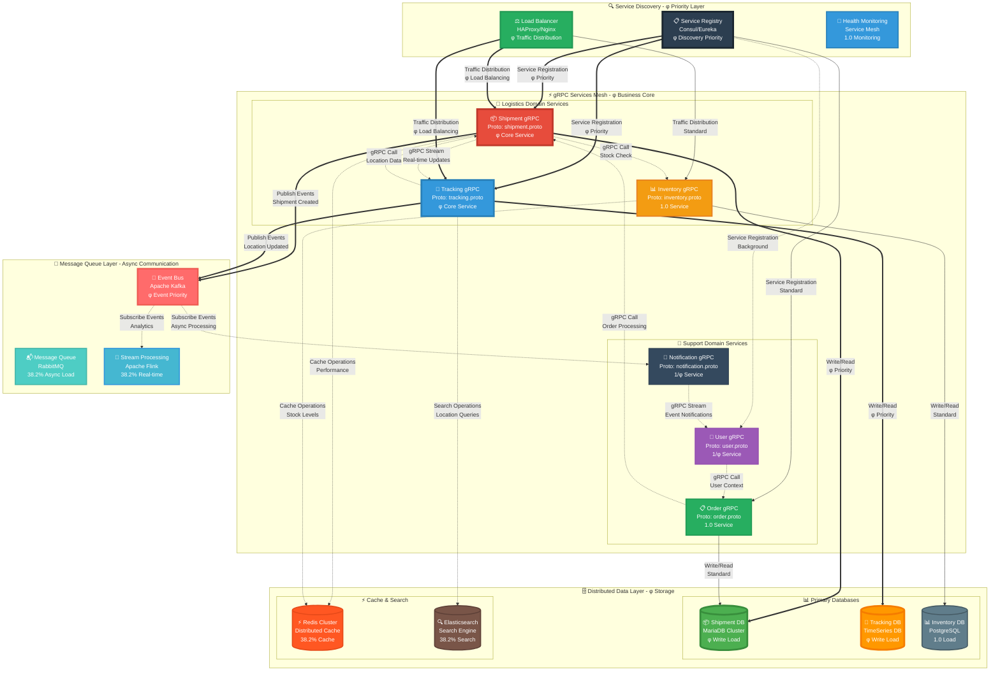

# 🚚 Logistics Management System - API Gateway

<div align="center">

<!-- Golden Ratio Typography: φ emphasis for logistics excellence -->
<h2 style="font-size: 1.618em; color: #2c3e50; margin: 26px 0;">
  ⚡ High-Performance gRPC API Gateway for Enterprise Logistics
</h2>

<p style="font-size: 1.2em; color: #34495e; max-width: 618px; margin: 0 auto;">
  <strong>Modern, scalable microservices architecture with TypeScript, Express.js, and gRPC following golden ratio design principles</strong>
</p>

<!-- Golden Ratio Badge Layout: Primary (61.8%) + Secondary (38.2%) -->
<div style="margin: 32px 0;">
  
  
  
</div>

<div style="margin: 20px 0;">
  
  
  
</div>

</div>

---

## 📋 Overview

This project serves as the **API Gateway** for a comprehensive logistics management system. It provides RESTful HTTP endpoints that communicate with backend microservices via gRPC, offering a unified interface for managing logistics operations including shipments, inventory, tracking, and order management.

### 🎯 Key Features

- **🔌 RESTful API Gateway**: Clean HTTP endpoints for client applications
- **⚡ gRPC Communication**: High-performance inter-service communication
- **🗄️ Database Integration**: MariaDB with TypeORM for robust data persistence
- **📦 TypeScript**: Full type safety and modern development experience
- **🏗️ Microservices Architecture**: Scalable and maintainable service design
- **🔐 Enterprise-Ready**: Built for production logistics systems

---

## 🛠️ Technology Stack

| Technology | Purpose | Version |
|------------|---------|---------|
| **TypeScript** | Primary programming language | Latest |
| **Express.js** | Web framework for API endpoints | 4.x |
| **gRPC** | Microservices communication protocol | Latest |
| **MariaDB** | Relational database management | 10.x+ |
| **TypeORM** | Database ORM and migration management | Latest |

---

## 🏗️ Architecture - Golden Ratio Design

<div align="center">

*Enterprise logistics architecture following φ proportions for optimal system visualization*

</div>

### 🌟 **High-Level System Architecture - Golden Ratio Layout**



### 🔄 **Request Flow Architecture - Golden Ratio Communication**

<div align="center">

*gRPC communication patterns optimized with φ proportions for efficient data flow*

</div>



### 🌐 **gRPC Service Mesh - Golden Ratio Microservices**

<div align="center">

*Advanced microservices communication mesh using φ proportions for optimal service interaction*

</div>



---

## 🚀 Getting Started

### Prerequisites

- Node.js (v16+ recommended)
- npm or yarn
- MariaDB Server (v10.5+)
- Basic understanding of gRPC and microservices

### Installation

1. **Clone the repository**
   ```bash
   git clone https://github.com/abdoElHodaky/logisticsassgrpc.git
   cd logisticsassgrpc
   ```

2. **Install dependencies**
   ```bash
   npm install
   # or
   yarn install
   ```

3. **Configure environment variables**
   ```bash
   cp .env.example .env
   ```
   
   Update `.env` with your configuration:
   ```env
   PORT=3000
   DB_HOST=localhost
   DB_PORT=3306
   DB_USER=your_user
   DB_PASSWORD=your_password
   DB_NAME=logistics_db
   GRPC_SERVICE_HOST=localhost
   GRPC_SERVICE_PORT=50051
   ```

4. **Run database migrations**
   ```bash
   npm run migration:run
   ```

5. **Start the development server**
   ```bash
   npm run dev
   ```

---

## 📚 API Endpoints

### Core Endpoints

The API Gateway exposes the following endpoint categories:

- **📦 Shipments**: Create, track, and manage shipments
- **📊 Inventory**: Monitor and update inventory levels
- **🚛 Tracking**: Real-time shipment tracking and status updates
- **📋 Orders**: Order processing and management
- **👥 Users**: User authentication and profile management

### Example Endpoints

```
GET    /api/shipments          - List all shipments
POST   /api/shipments          - Create new shipment
GET    /api/shipments/:id      - Get shipment details
PUT    /api/shipments/:id      - Update shipment
DELETE /api/shipments/:id      - Delete shipment

GET    /api/tracking/:id       - Track shipment status
GET    /api/inventory          - View inventory
POST   /api/orders             - Create new order
```

---

## 🔧 Development

### Available Scripts

```bash
npm run dev          # Start development server with hot reload
npm run build        # Build for production
npm run start        # Start production server
npm run test         # Run test suite
npm run lint         # Lint code
npm run migration:generate  # Generate new migration
npm run migration:run       # Run pending migrations
```

### Project Structure

```
logisticsassgrpc/
├── src/
│   ├── controllers/     # Request handlers
│   ├── services/        # Business logic & gRPC clients
│   ├── entities/        # TypeORM database entities
│   ├── routes/          # API route definitions
│   ├── middleware/      # Express middleware
│   ├── config/          # Configuration files
│   └── proto/           # gRPC protocol buffer definitions
├── migrations/          # Database migrations
├── tests/              # Test files
└── package.json
```

---

## 🔐 Security Features

- Input validation and sanitization
- Rate limiting on API endpoints
- CORS configuration
- SQL injection protection via TypeORM
- Environment-based configuration

---

## 🧪 Testing

```bash
# Run all tests
npm test

# Run tests with coverage
npm run test:coverage

# Run specific test suite
npm test -- shipments.test.ts
```

---

## 📈 Performance

- **gRPC Protocol**: Binary protocol for efficient service-to-service communication
- **Connection Pooling**: Optimized database connections
- **Async/Await**: Non-blocking asynchronous operations
- **Caching**: Redis integration ready for response caching

---

## 🤝 Contributing

Contributions are welcome! Please follow these steps:

1. Fork the repository
2. Create a feature branch (`git checkout -b feature/amazing-feature`)
3. Commit your changes (`git commit -m 'Add amazing feature'`)
4. Push to the branch (`git push origin feature/amazing-feature`)
5. Open a Pull Request

---

## 📝 License

This project is licensed under the MIT License - see the [LICENSE](LICENSE) file for details.

---

## 👤 Author

**abdoElHodaky**
- GitHub: [@abdoElHodaky](https://github.com/abdoElHodaky)

---

## 🙏 Acknowledgments

- Express.js community for the robust web framework
- gRPC team for the efficient RPC framework
- TypeORM contributors for the excellent ORM
- MariaDB Foundation for the reliable database

---

## 📞 Support

For issues, questions, or contributions, please open an issue on GitHub or contact the maintainer.

---

<div align="center">

**⭐ Star this repository if you find it helpful!**

Made with ❤️ for the logistics industry

</div>

---

## 📝 One-Line Summary

**A production-ready TypeScript API Gateway that bridges RESTful HTTP clients with gRPC-based logistics microservices (shipments, inventory, tracking, orders) using Express.js for routing and TypeORM with MariaDB for type-safe data persistence in an enterprise-grade, scalable microservices architecture.**
